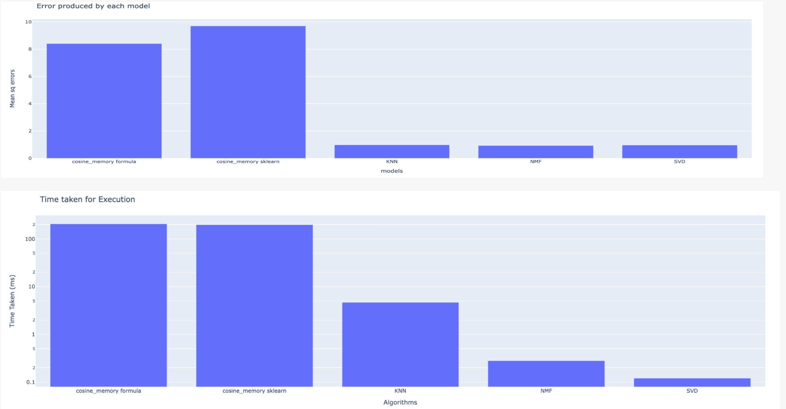

# Comparative Analysis of Memory-Based and Model-Based Collaborative Filtering Recommendation Systems

This project is a comparative analysis of memory-based and model-based collaborative filtering (CF) recommendation systems. The analysis was conducted using the MovieLens-100k dataset, which includes 100,000 ratings from 943 users on 1,682 movies. The goal of the project is to determine which method of filtering—memory-based or model-based—produces better results on this dataset.

## Table of Contents

- [Introduction](#introduction)
- [Dataset](#dataset)
- [Methods](#methods)
- [Feature Engineering](#feature-engineering)
- [Results](#results)
- [Conclusion](#conclusion)

## Introduction

Recommendation systems are crucial for personalizing user experiences across various platforms, from streaming services to e-commerce websites. This project compares the performance of memory-based and model-based collaborative filtering approaches to provide insights into their effectiveness.

## Dataset

The project utilizes the MovieLens-100k dataset, which consists of:
- **100,000 ratings** (1-5 scale) from **943 users** on **1,682 movies**
- Each user has rated at least 20 movies.
- The dataset includes simple demographic information for the users.

## Methods

### Memory-Based Collaborative Filtering
Memory-based CF is divided into user-based and item-based filtering. A similarity matrix was created for both users and items using cosine similarity, and the weighted rating predictions were generated. We evaluated the performance using Mean Squared Error (MSE).

### Model-Based Collaborative Filtering
Model-based CF employs machine learning algorithms to predict user ratings of unrated items. We utilized techniques like Singular Value Decomposition (SVD) and Non-negative Matrix Factorization (NMF). These models factorize the user-item matrix to discover latent features and predict missing ratings.

### Evaluation
We implemented and trained multiple models, including K-Nearest Neighbors (KNN) using cosine similarity, to provide a baseline comparison. The performance was measured using MSE.

## Feature Engineering

We split the dataset into training and test sets by removing 10 ratings per user to ensure the test data is not filled with all zeros. This approach allows us to calculate MSE by comparing predicted values of the train data to known values in the test data.

## Results

1. **Memory-Based CF**: User-based filtering performed better than item-based filtering.
2. **Model-Based CF**: NMF showed better accuracy but required more execution time.
3. **KNN Results**: Confirmed that the problem lies not in the method itself but in the logic and execution.

Overall, model-based recommender systems significantly outperformed memory-based systems due to their ability to identify latent features and clusters.

## Conclusion

The analysis revealed that model-based approaches, especially those using machine learning algorithms, provide better accuracy than memory-based approaches. However, the efficiency of memory-based CF depends heavily on the logic implementation and execution speed, suggesting the potential for optimization using lower-level programming languages.

Despite the findings, further research is necessary to fully validate these conclusions, especially given the lack of publicly available papers on the topic.
